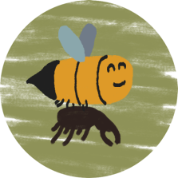

## What is {{name}}?
{{name}} is a discord bot & steam integration that helps you gather feedbacks on your games.  
[Invite BugBee to your server](https://discord.com/oauth2/authorize?client_id=1150747928885989376)

It **does not store any report**, it only forward them to a dedicated channel in your discord server. Please review the [Privacy Policy](./privacy.md) for more details.

## Getting Started
1. Click on the following link to add {{name}} to your game or company discord:  
[Invite BugBee to your server](https://discord.com/oauth2/authorize?client_id=1150747928885989376)

2. Create a private channel, we'll call it the **Backend Channel**, and give access to people reviewing the feedbacks as well as {{name}}
3. Initialize {{name}} by typing `/init` in the **Backend Channel**
4. For each games you want to receive feedbacks on, create a dedicated **Frontend Channel**, and register it by typing: `/add_game <your game name>`
5. To enable Steam Integration for your game, type the following command in your game's **Frontend Channel**: `/add_steam <game_steam_appid>`

## Removing a Frontend Channel
If you want to remove a Frontend Channel, you can do so by typing `/unregister_game_channel` in the target channel.

## Moving Backend Channel
To identify a channel, {{name}} is using the discord channel id, it means you can move or rename your channels without incidence.
If you do want to register a new Backend Channel though, you can remove the bot completely and re-configure both your Backend Channel and your Frontend Channels.

## Removing BugBee
To remove BugBee and have the bot forget everything about your server, you can run the following command: `/remove_bugbee`.
When the command is successful, you can remove {{name}} user from your server.

## How can I get some support
Join us on {{discord}} to get support, leave a feedback, report a bug, or ask for a new feature!